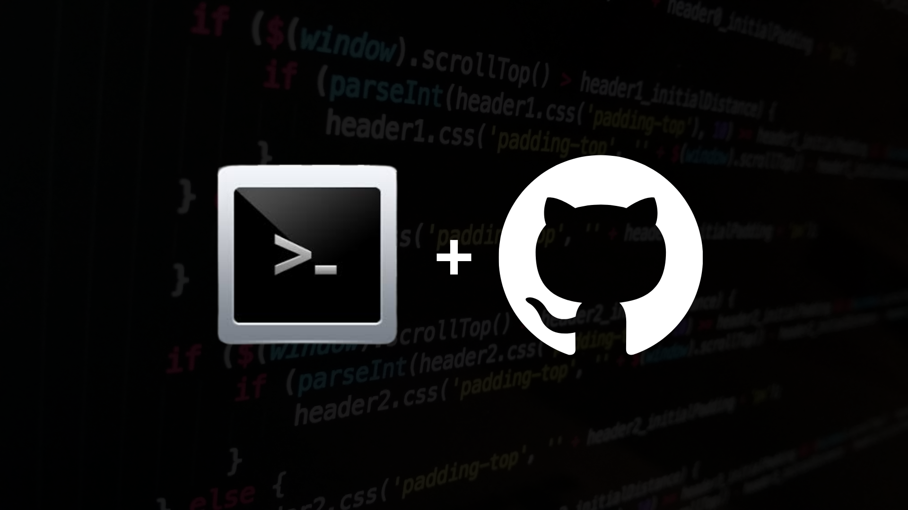

# Shell Program Collections

A shell script is a computer program designed to be run by the Unix shell, a command-line interpreter. The various dialects of shell scripts are considered to be scripting languages. Typical operations performed by shell scripts include file manipulation, program execution, and printing text. To know more visit [here](https://en.wikipedia.org/wiki/Shell_script)

# How to Run a Shell Script
- For __Mac OS__ and __Windows__
  - Go to any Online Shell Script Editor to run the Programs
  - Some of them are:
    - [Online Bash Shell](https://www.onlinegdb.com/online_bash_shell)
    - [run bash online](https://rextester.com/l/bash_online_compiler)
- For __Linux__
  - Open the Terminal
  - Use either of the editors ``` vi ``` or ``` nano ```
    - To know how to use vi editor click on this [link](About/vi_tutorial.md)
    - To know how to use nano editor click on this [link](About/nano_tutorial.md)
  - Run the code using the command ``` bash FILENAME.sh ``` __Replace FILENAME with the name of your file__

# Programs available
- [Factorial of a Number](Factorial.sh)
- [Factorial of a Number using Function](Factorial_of_a_Number_using_Functions.sh)
- [Multiplication Table](Multiplication_Table.sh)
- [Fibonacci upto 'N' Terms](N_term_Fibonacci.sh)
- [Prime Number check](Prime_check.sh)
- [Maximum of Three Numbers](largest_among_three.sh)
- [Minimum of Three Numbers](smallest_among_three.sh)
- [Printing of User Data](User_data.sh)
- [Krishnamurthy NUmber Checker](Krishnamurthy_Number_Checker.sh)
- [Triangle with Hypotenous on Right and Reverse Number](left_tri__num_rev.sh)
- [Left Triangle with ```*``` ](left_tri.sh)
- [Box made with ```#``` ](hash_box.sh)
- [Array Manipulation](Array_Manupulation.sh)
- [Largest Number in the Array](Largest_Elements_in_the_array.sh)
- [Sorting Elements using Bubble sort](Sorting_elements_in_the_array.sh)

# New To GitHub??
* [Intro to GitHub](https://youtu.be/wTTek8P2VB4)
* [How to Create a Repository](https://youtu.be/o6T5F7-SOAo)
* [Cloning a Repository](https://youtu.be/oYselL5G280)
* [Contributing to a Project](https://youtu.be/4vq07q7g2xE)
